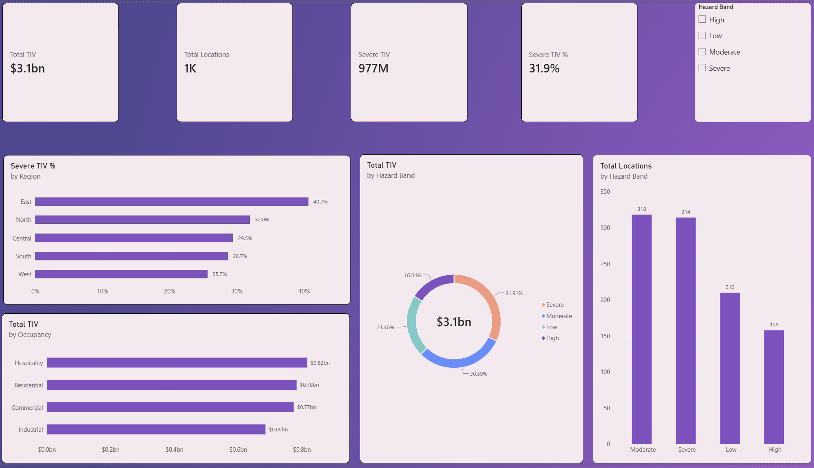
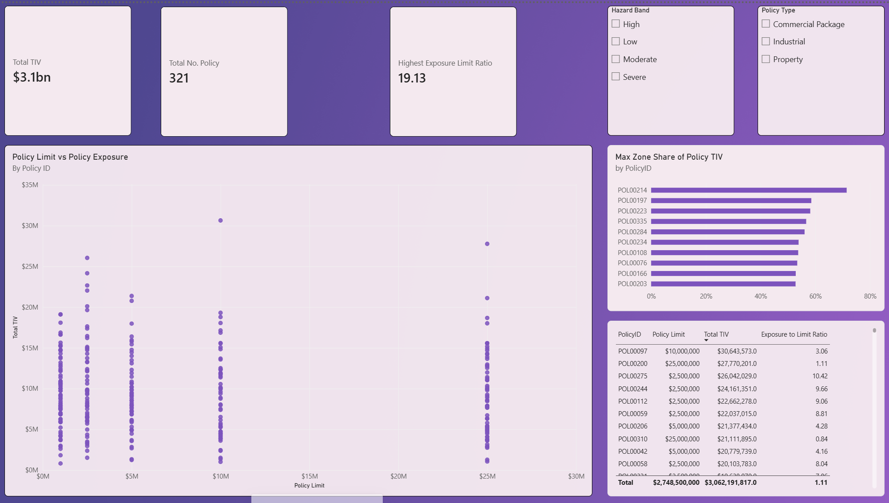
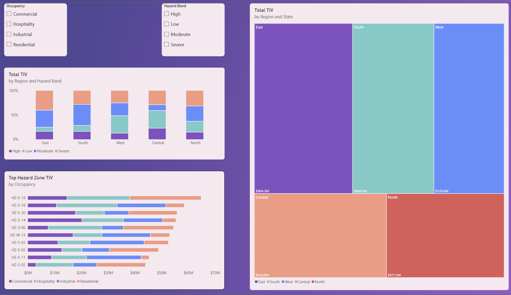

# Catastrophe Risk Exposure Analysis

## Project Overview

This project analyses a simulated insurance exposure portfolio to identify concentrations of insured value across policies, geographic regions and hazard zones. The analysis uses location-level exposure data containing Total Insured Value (TIV), policy information and hazard characteristics. PostgreSQL is used to join, aggregate and analyse the datasets to identify significant exposure concentrations and areas with elevated hazard exposure.


The project focuses on questions such as:

- Which regions have the greatest concentration of insured exposure?
- Which regions have the greatest concentration of severe hazard exposure?
- Which policies have high exposure relative to their policy limits?
- Which policy and hazard-zone combinations represent the greatest accumulation risk?
- Which states have the greatest concentration of insured value, and how dependent is each state's exposure on its largest hazard zone?
- Which occupancy, construction type and building-age groups have the greatest insured value exposed to severe hazard zones and what proportion of     their total exposure is located within severe zones?

## Tools Used

- PostgreSQL
- SQL
- pgAdmin
- VS Code
- Excel
- Power BI

## Dataset

The project uses three datasets:

- Exposure.csv – location-level insured exposure information.
- Policy.csv – policy limits, deductibles and other policy information.
- Hazard.csv – hazard-zone characteristics and hazard classifications.


## Database Schema

The database consists of three related tables: `exposure`, `policy`, and `hazard`.

### Policy Table

| Column | Data Type |
|---|---|
| policy_id | VARCHAR(20) - Primary Key |
| underwriter_id | VARCHAR(20) |
| policy_type | VARCHAR(100) |
| policy_limit_usd | BIGINT |
| deductible_usd | BIGINT |
| attachment_point_usd | BIGINT |
| participation_share | NUMERIC(5,2) |
| limit_basis | VARCHAR(50) |
| policy_status | VARCHAR(50) |

### Hazard Table

| Column | Data Type |
|---|---|
| hazard_zone_id | VARCHAR(20) - Primary Key |
| region | VARCHAR(50) |
| wind_speed_1in100_mph | INT |
| flood_depth_1in100_m | NUMERIC(10,2) |
| pga_1in475_g | NUMERIC(10,3) |
| wildfire_score_0_100 | INT |
| hail_score_0_100 | INT |
| composite_hazard_score | NUMERIC(10,2) |
| hazard_band | VARCHAR(50) |

### Exposure Table

| Column | Data Type |
|---|---|
| location_id | VARCHAR(20) - Primary Key |
| account_id | VARCHAR(20) |
| policy_id | VARCHAR(20) - Foreign Key |
| region | VARCHAR(50) |
| state | VARCHAR(10) |
| postal_code | INT |
| latitude | NUMERIC(10,5) |
| longitude | NUMERIC(10,5) |
| hazard_zone_id | VARCHAR(20) - Foreign Key |
| occupancy | VARCHAR(100) |
| construction_code | VARCHAR(50) |
| year_built | INT |
| number_of_stories | INT |
| building_tiv_usd | BIGINT |
| contents_tiv_usd | BIGINT |
| business_interruption_tiv_usd | BIGINT |
| total_tiv_usd | BIGINT |

### Table Relationships

- exposure.policy_id → policy.policy_id
- exposure.hazard_zone_id → hazard.hazard_zone_id

Exposure sits as the central table connecting both policy and hazard with common fields.


# SQL Analysis

## 1. Exposure by Region

**Question**
Which regions have the greatest concentration of insured exposure?

This analysis aggregates location-level exposure by region to calculate the total insured value (TIV) and number of insured locations.

```sql
SELECT
    exposure.region,
    SUM(exposure.total_tiv_usd) AS total_tiv, -- Calculates TIV across all locations in each region
    COUNT(exposure.location_id) AS location_count -- Counts number of locations within each region

FROM exposure

GROUP BY exposure.region

ORDER BY total_tiv DESC;
```

## 2. Severe Hazard Exposure by Region
Which regions have the greatest proportion of insured value located within severe hazard zones?

This analysis aggregates location-level exposure by region with greatest concentration of severe hazard exposure.

```sql
WITH exposure_region AS ( -- Aggregates location-level exposure to one row per region
    SELECT
        exposure.region,

        SUM(exposure.total_tiv_usd) AS total_tiv, -- Calculates total TIV across all locations within each region

        SUM(
            CASE
                WHEN hazard.hazard_band = 'Severe'
                THEN exposure.total_tiv_usd
                ELSE 0 
            END
        ) AS severe_tiv, -- Calculates the amount of regional TIV located within severe hazard zones

        SUM(
            CASE
                WHEN hazard.hazard_band = 'Severe'
                THEN 1
                ELSE 0
            END
        ) AS severe_location_count -- Counts the number of locations within severe hazard zones for each region

    FROM exposure
    
    LEFT JOIN hazard 
        ON exposure.hazard_zone_id = hazard.hazard_zone_id -- Adds the hazard classification associated with each exposure location
    
    GROUP BY exposure.region
)

SELECT
    exposure_region.region,
    exposure_region.total_tiv,
    exposure_region.severe_tiv,
    exposure_region.severe_location_count,

    (
        exposure_region.severe_tiv /
        NULLIF(exposure_region.total_tiv, 0)
    ) * 100.00 AS severe_tiv_percentage -- Calculates the percentage of each region's total TIV located within severe hazard zones

FROM exposure_region

ORDER BY severe_tiv_percentage DESC;
-- Ranks regions from highest to lowest severe hazard exposure concentration
```

## 3. Exposure vs Policy Limit 

Which policies have the greatest insured exposure relative to their policy limits, and how much of that exposure is located in severe hazard zones?

This analysis aggregates location-level exposure data to the policy level. It calculates total insured value (TIV), the number of insured locations, TIV located in severe hazard zones, and the ratio between total TIV and the policy limit.

```sql
WITH policy_exposure AS (
    SELECT
        exposure.policy_id,
        policy.policy_limit_usd,

        SUM(exposure.total_tiv_usd) AS total_policy_tiv, -- Calculates total TIV for each policy
        COUNT(exposure.location_id) AS location_count, -- Counts how many exposure locations belong to each policy.

        SUM(
            CASE
                WHEN hazard.hazard_band = 'Severe' -- Includes TIV only from severe hazard locations
                THEN exposure.total_tiv_usd
                ELSE 0
            END
        ) AS severe_tiv

    FROM exposure 

    LEFT JOIN policy
        ON exposure.policy_id = policy.policy_id -- Adds the policy limit required for the exposure-to-limit comparison


LEFT JOIN hazard
        ON exposure.hazard_zone_id = hazard.hazard_zone_id -- Adds hazard classifications for each exposure location

    GROUP BY
        exposure.policy_id, 
        policy.policy_limit_usd
)

SELECT
    policy_exposure.policy_id,
    policy_exposure.policy_limit_usd,
    policy_exposure.total_policy_tiv,
    policy_exposure.location_count,
    policy_exposure.severe_tiv,
   
    policy_exposure.total_policy_tiv / -- Dividing the total_policy_tiv by the policy_limit gives the ratio.
        NULLIF(policy_exposure.policy_limit_usd, 0) AS exposure_to_limit_ratio -- Compares total policy TIV with the policy limit while preventing                                                                                     division by zero.


FROM policy_exposure

ORDER BY policy_exposure.total_policy_tiv DESC; -- Ranks policies from highest to lowest total TIV
```

## 4. Average policy TIV 

Which policies have above-average total TIV and at least 3 insured locations?

This analysis aggregates exposure at the policy level and identifies policies with above-average total TIV and at least three insured locations. It also shows each policy's type, policy limit, location count, and average TIV per location.

```sql

WITH policy_exposure AS (
    SELECT
        policy_id,
        SUM(total_tiv_usd) AS total_policy_tiv,
        COUNT(location_id) AS location_count,
        AVG(total_tiv_usd) AS avg_location_tiv

    FROM exposure

    GROUP BY policy_id
)

SELECT
    policy.policy_id,
    policy.policy_type,
    policy.policy_limit_usd,
    policy_exposure.total_policy_tiv,
    policy_exposure.location_count,
    policy_exposure.avg_location_tiv

FROM policy_exposure

INNER JOIN policy -- Using inner join as only require valid policies with corresponding policy information for this analysis.
    ON policy_exposure.policy_id = policy.policy_id

WHERE policy_exposure.total_policy_tiv > ( -- Finds policies where the total TIV is greater than the average
    SELECT AVG(total_policy_tiv)
    FROM policy_exposure
)

AND policy_exposure.location_count >= 3 -- Only selects policies with at least 3 locations

ORDER BY policy_exposure.total_policy_tiv DESC;
```

## 5. Policy Hazard-Zone Exposure Concentration

Which policy and hazard-zone combinations represent the greatest accumulation risk?

This analysis aggregates exposure at the policy and hazard-zone level to identify policies with significant exposure concentrated within individual hazard zones. It highlights policy and hazard-zone combinations where more than 25% of the policy's total TIV is located within a single zone and where the hazard-zone TIV equals or exceeds the policy limit.

The results are ranked by hazard-zone TIV in descending order, allowing the largest exposure accumulations to be identified first. The hazard band is also included to provide additional context on the hazard characteristics associated with each concentration.

```sql

WITH policy_exposure AS ( -- Aggregates location level exposure at policy level.
    SELECT
        exposure.policy_id,
        policy.policy_limit_usd,
        
        SUM(total_tiv_usd) AS total_policy_tiv, -- Calculates the total TIV across all locations belonging to each policy.
        
        COUNT(location_id) AS location_count -- Counts how many locations belong to that policy.

FROM exposure

    JOIN policy ON 
        exposure.policy_id = policy.policy_id
    
    GROUP BY exposure.policy_id,
             policy.policy_limit_usd
),

policy_hazard_exposure AS( -- Aggregates exposure by policy and hazard zone.
    SELECT
        exposure.policy_id,
        exposure.hazard_zone_id,
        hazard.hazard_band,

        SUM(exposure.total_tiv_usd) AS zone_tiv,-- Calculates TIV for each policy within each individual hazard zone.

        COUNT(exposure.location_id) AS zone_location_count -- Counts the locations for each policy within each hazard zone.
    
    FROM exposure

    LEFT JOIN hazard ON exposure.hazard_zone_id = hazard.hazard_zone_id

    GROUP BY 
    exposure.policy_id,
    exposure.hazard_zone_id,
    hazard.hazard_band

)  

SELECT -- Combines policy-level exposure with hazard-zone exposure to measure concentration within each policy.
    policy_exposure.policy_id,
    policy_exposure.total_policy_tiv,
    policy_exposure.policy_limit_usd,
    policy_hazard_exposure.zone_location_count,
    policy_hazard_exposure.hazard_band,
    policy_hazard_exposure.zone_tiv,
    policy_hazard_exposure.hazard_zone_id,
    
    
(
    policy_hazard_exposure.zone_tiv/
        NULLIF(policy_exposure.total_policy_tiv,0)  -- Dividing zone tiv by total policy tiv to calculate the percentage of the policy's total TIV                                                          that is concentrated within that specific hazard zone.
)*100.00 AS hazard_zone_share_of_policy_tiv,

policy_hazard_exposure.zone_tiv/
    NULLIF(policy_exposure.policy_limit_usd,0) AS zone_tiv_to_limit_ratio -- Calculates the hazard-zone TIV relative to the policy limit.

FROM policy_exposure

JOIN policy_hazard_exposure ON policy_hazard_exposure.policy_id = policy_exposure.policy_id


WHERE   (
        policy_hazard_exposure.zone_tiv/
        NULLIF(policy_exposure.total_policy_tiv,0) -- Filters for cases where at least 25% of the policy's total TIV is concentrated within one specfic hazard zone.
) *100.00>= 25


AND     (
        policy_hazard_exposure.zone_tiv/
        NULLIF(policy_exposure.policy_limit_usd,0) -- Filters for cases where the hazard-zone TIV is equal to or exceeds the policy limit.
) >= 1


ORDER BY policy_hazard_exposure.zone_tiv DESC, 
         zone_tiv_to_limit_ratio DESC;
```


## 6. Hazard Zone Exposure Concentration by State

Which states have the greatest concentration of insured value, and how dependent is each state's exposure on its largest hazard zone?

This analysis aggregates exposure at the state and hazard-zone level to identify which states have the greatest concentration of insured value within a single hazard zone. It identifies the hazard zone with the highest TIV in each state and calculates the percentage of the state's total TIV concentrated within that zone. The results are ranked by this percentage to highlight states that are most dependent on their largest hazard-zone concentration.

```sql

WITH state_exposure AS(
    SELECT
        exposure.state,
        
        SUM(exposure.total_tiv_usd) AS total_state_tiv, -- Calculates TIV for each state.

        COUNT(location_id) AS state_location_count -- Counts the total number of locations within each state.
    FROM exposure

    GROUP BY exposure.state
), 

state_hazard_exposure AS ( -- Aggregates exposure to one row per state and hazard-zone combination.
    SELECT
        exposure.state,
        exposure.hazard_zone_id,
        
        SUM(exposure.total_tiv_usd) AS state_zone_tiv, -- Calculates TIV in each individual hazard zone
        
        COUNT(exposure.location_id) AS zone_location_count -- -- Counts locations within each state and hazard-zone combination.
    FROM exposure

    GROUP BY
        exposure.state,
        exposure.hazard_zone_id
),

ranked_zones AS ( -- Compares state-level exposure with hazard-zone exposure and ranks hazard zones by TIV within each state.
    SELECT
        state_exposure.state,
        state_exposure.total_state_tiv,
        state_exposure.state_location_count,

        state_hazard_exposure.state_zone_tiv,
        state_hazard_exposure.hazard_zone_id,
        state_hazard_exposure.zone_location_count,

    ROW_NUMBER() OVER ( 
    PARTITION BY state_exposure.state -- Restarts the hazard-zone ranking for each state
    ORDER BY state_hazard_exposure.state_zone_tiv DESC -- Ranks hazard zones from highest to lowest TIV within each state.
    ) AS zone_rank,

( 
    state_hazard_exposure.state_zone_tiv/
        NULLIF(state_exposure.total_state_tiv,0) -- Calculates the share of total TIV each hazard zone represent relative to the state total TIV.
)*100 AS zone_share_tiv
    
    FROM state_exposure
    
    JOIN state_hazard_exposure ON state_exposure.state = state_hazard_exposure.state -- Joins state totals to each state's hazard-zone totals so zone exposure can be compared with overall state exposure. 
)

SELECT
    ranked_zones.state,
    ranked_zones.total_state_tiv,
    ranked_zones.state_location_count,
    ranked_zones.hazard_zone_id,
    ranked_zones.state_zone_tiv,
    ranked_zones.zone_location_count,
    ranked_zones.zone_share_tiv
       
FROM ranked_zones

WHERE ranked_zones.zone_rank = 1 -- Keeps only the hazard zone with the largest TIV within each state.

ORDER BY ranked_zones.zone_share_tiv DESC; -- Ranks states by the percentage of total state TIV
```

## 7. Hazard Zone Exposure by Occupancy, Construction Type and Year Built

Which occupancy, construction type and building-age groups have the greatest insured value exposed to severe hazard zones and what proportion of     their total exposure is located within severe zones?

This analysis examines how insured exposure within severe hazard zones varies by occupancy, construction type and building age. Location-level exposure is grouped into building-age bands and combined with hazard classifications to calculate total TIV, severe-zone TIV, the number of severe-zone locations and the proportion of each group's total TIV located within severe hazard zones.

```sql
WITH construction_period AS ( 
    SELECT
        exposure.*,
        CASE
            WHEN exposure.year_built < 1960 THEN 'Pre-1960'
            WHEN exposure.year_built BETWEEN 1960 AND 1979 THEN '1960-1979'
            WHEN exposure.year_built BETWEEN 1980 AND 1999 THEN '1980-1999'
            WHEN exposure.year_built BETWEEN 2000 AND 2019 THEN '2000-2019'
            WHEN exposure.year_built > 2019 THEN 'Post-2019'
        END AS year_built_band -- Creates year of construction band
    FROM exposure
),

occupancy_construction_exposure AS ( -- Aggregates exposure by occupancy, construction type and the year of construction. Assesses each variable                                             relative to severe hazard exposure
    SELECT
        construction_period.occupancy,
        construction_period.construction_code,
        construction_period.year_built_band,

        SUM(construction_period.total_tiv_usd) AS total_tiv, -- Calculates total TIV for each property group.  

        COUNT(DISTINCT construction_period.policy_id) AS policy_count, -- Counts number of policies contributing to each group.
        
        SUM(
            CASE
                WHEN hazard.hazard_band = 'Severe'
                THEN construction_period.total_tiv_usd 
                ELSE 0
            END
        
         ) AS severe_tiv, -- Calculates TIV in severe hazard zones.
         
         SUM(
            CASE
                WHEN hazard.hazard_band = 'Severe'
                THEN 1
                ELSE 0
            END
        ) AS severe_location_count -- Calculates number of locations in severe hazard zones.

    FROM construction_period
    
    LEFT JOIN hazard ON construction_period.hazard_zone_id = hazard.hazard_zone_id
    
    GROUP BY construction_period.occupancy,
             construction_period.construction_code,
             construction_period.year_built_band
),

severe_exposure_share AS (
    SELECT
        occupancy_construction_exposure.*,

        (
            occupancy_construction_exposure.severe_tiv /
            NULLIF(occupancy_construction_exposure.total_tiv, 0)  -- Calculates the share of severe TIV relative to the total TIV.
        ) * 100.00 AS severe_tiv_share

    FROM occupancy_construction_exposure
)

SELECT 
    severe_exposure_share.occupancy,
    severe_exposure_share.construction_code,
    severe_exposure_share.year_built_band,
    severe_exposure_share.total_tiv,
    severe_exposure_share.severe_tiv,
    severe_exposure_share.severe_tiv_share,
    severe_exposure_share.severe_location_count,
    severe_exposure_share.policy_count,
    
        ROW_NUMBER() OVER(
            ORDER BY severe_exposure_share.severe_tiv_share -- Ranks the groups on the concentration of severe TIV.
        ) AS severe_tiv_share_rank, -- Deliberately have not used DESC as the largest severe TIV concentrations will appear at the top of the list.

        ROW_NUMBER() OVER(
            ORDER BY severe_exposure_share.severe_tiv -- Ranks the groups by absolute severe TIV.
        ) AS severe_tiv_rank -- Deliberately have not used DESC as the largest severe TIV's will appear at the top of the list.
    

FROM severe_exposure_share

ORDER BY severe_tiv_rank DESC;
```


## Power BI Dashboard
The cleaned exposure, policy and hazard datasets were imported into Power BI to create a three-page interactive dashboard covering portfolio exposure, policy-level analysis and hazard concentration.

An interactive Power BI dashboard was developed to analyse portfolio
exposure, policy-level metrics and catastrophe hazard concentrations.

Note: The Power BI .pbix file is not included in this repository due to its file size.


### Exposure Overview



### Policy Analysis


### Hazard Analysis



## Key Findings
- **Regional Exposure:** The **East** region has the largest overall exposure **($804.3 million)**, whilst the **North** has the         least **($477.2 million)**.
- **Policy Exposure:** **POL00097** had the largest total insured value at approximately **$30.6 million** distributed across 7 insured locations.      Its total TIV represented 3 times the policy limit.
* **Severe Hazard Exposure by Region:**

  * **Highest Severe Exposure Concentration:** **East** had the highest relative concentration of severe hazard exposure, with approximately **40% of its total TIV** located within severe hazard zones. This represented approximately **$327 million in severe TIV** across **108 insured locations**.
  * **Largest Absolute Severe Exposure:** The East also had the largest absolute amount of TIV located within severe hazard zones, demonstrating that it had both the highest absolute severe exposure and the highest relative Severe exposure concentration among the regions analysed.

* **Policy Hazard-Zone Concentration:**

  * **Largest Hazard-Zone Exposure:** POL00275 had the largest qualifying hazard-zone exposure, with approximately **$8.6 million in TIV** concentrated within **HZ-W-07**, a **severe** hazard zone. This represented approximately **32.9%** of the policy's total TIV and **3.4x** its $2.5 million policy limit.
  * **Highest Zone TIV-to-Limit Ratio:** POL00072 had the highest zone TIV-to-limit ratio at approximately **6.4x**. Its hazard zone, **HZ-C-11**, contained approximately **$6.4 million in TIV**, representing **43.6%** of the policy's total exposure. However, this exposure was associated with a **low** hazard band, demonstrating that a high exposure-to-limit ratio does not necessarily correspond to high hazard severity.
  * **High Concentration and High Hazard:** POL00169 had approximately **64.3%** of its total policy TIV concentrated within **HZ-E-20**, a **High** hazard zone. The zone contained approximately **$5.9 million in TIV**, equivalent to **5.9x** the policy's $1 million limit.
  * **Fully Concentrated Policies:** Several qualifying policies had **100% of their total TIV concentrated within a single hazard zone**, demonstrating cases where all insured value associated with the policy was located within one zone. These cases occurred across different hazard bands, including low, moderate and severe.
* **Concentration Relative to Policy Limit:**

  * **Largest Policy Exposure:** POL00097 had the highest total policy TIV at approximately **$30.6 million** across seven insured locations. Its total TIV was approximately **3.1x** its **$10 million policy limit**, with around **$4.0 million** located in severe hazard zones.
  * **Highest Exposure-to-Limit Ratio:** POL00308 had the highest exposure-to-limit ratio at approximately **19.1x**, with **$19.1 million** in total TIV compared with a **$1 million policy limit**. Approximately **$10.0 million** of this exposure was located in severe hazard zones.
  * **Largest Severe Hazard Exposure:** POL00275 had the highest severe-zone TIV at approximately **$20.2 million** out of **$26.0 million** in total policy TIV. This means approximately **77.7%** of the policy's insured value was associated with severe hazard zones, while its total TIV was approximately **10.4x** its **$2.5 million policy limit**.

* **State-Hazard Zone Concentration:**

  * **Highest Total State Exposure:** New Jersey had the largest overall exposure, with approximately **$273.7 million in total TIV** across **85 insured locations**. Its largest hazard zone, **HZ-E-09**, contained approximately **$29.4 million**, representing **10.8%** of the state's total TIV.
  * **Greatest Hazard-Zone Concentration:** Texas had the greatest concentration of exposure within a single hazard zone. **HZ-S-06** contained approximately **$35.3 million in TIV**, representing **17.2%** of Texas's total state TIV. This was also the largest individual hazard-zone TIV among the states analysed.
  * **Other Notable Concentrations:** Pennsylvania and Massachusetts had the next-highest single-zone concentrations, with their largest hazard zones accounting for approximately **13.7%** and **13.2%** of total state TIV, respectively.
  * **Lowest Hazard-Zone Concentration:** Louisiana had the lowest concentration within its largest hazard zone at approximately **9.6%**, indicating that its exposure was more dispersed across hazard zones than the other states analysed.

* **Property Characteristics concentration**

   * **Synopsis:** Severe hazard exposure varies quite considerably across property characteristics. Hospitality properties with concrete construction built between 1960–1979 recorded the largest severe-zone exposure at approximately **$36.2m**, representing **47.6%** of the group's total TIV. However, this is spread over 11 severe locations and shared among 23 individual policies. 
   *  **Exposure by Building Age:** Properties constructed between 1960 and 1979 had the highest severe TIV at approximately **$29.1m** which represented **35%** of the **$82m** total TIV.
   *  **Exposure by Occupancy:** Hospitality recorded both the highest absolute TIV and severe TIV at **$81.7m** and **$26.3m** respectively. Severe TIV contributed 32% towards the total TIV for hospitality. Conversely, industrial properties recorded both the lowest absolute TIV **($68.6m)** and severe TIV **($20.6m)**. Overall, severe TIV concentration was relatively consistent across occupancy types, ranging from approximately **30%** to **32%**.
   *  **Exposure by Construction Type:** Concrete recorded the greatest concentration of severe TIV at around **35%** with a severe TIV of **$80.6m**. However, masonry recorded a greater absolute TIV of **$81.2m** compared with **$80.6m** for concrete. On the other hand, masonry has a significantly lower exposure in severe hazard zones, with **29%** of it's total TIV located within severe hazard zones.
 
 
 **Exposure Distribution:** The analysis identified differences in both the absolute amount and relative concentration of severe hazard exposure          across regions, demonstrating why total TIV and hazard concentration should be considered separately.


## Data Quality 

### Data Quality Checks

Before conducting the exposure analysis, data quality checks were performed to identify potential issues that could affect the reliability of the results.

Checks included:
- Duplicate Location IDs
- Missing Policy and Hazard Zone IDs
- Zero or negative TIV
- TIV reconciliation errors
- Invalid or missing geographic coordinates
- Missing construction, occupancy and year-built information
- Policy IDs not present in the Policy dataset
- Hazard Zone IDs not present in the Hazard datase

Basic checks were performed as part of the SQL analysis before creating an automated Python data quality pipeline using Pandas.

### TIV Reconciliation

The reported total TIV was compared with the sum of building, contents and business interruption TIV for each insured location.

```sql
SELECT
    exposure.location_id,
    exposure.building_tiv_usd,
    exposure.contents_tiv_usd,
    exposure.business_interruption_tiv_usd,
    exposure.total_tiv_usd
FROM exposure
WHERE exposure.total_tiv_usd <>
      exposure.building_tiv_usd
      + exposure.contents_tiv_usd
      + exposure.business_interruption_tiv_usd;
```

**Result:** No discrepancies were identified, indicating that the reported total TIV matched with its component values across all locations.

### Policy, Location and Hazard-zone Reconciliation

A data quality check was performed to identify missing policy and hazard-zone identifiers. Both `NULL` values and blank strings were checked to ensure that missing values stored in different formats were identified.

```sql
SELECT
    exposure.location_id,
    exposure.policy_id,
    exposure.hazard_zone_id
FROM exposure
WHERE exposure.policy_id IS NULL
   OR TRIM(exposure.policy_id) = ''
   OR exposure.hazard_zone_id IS NULL
   OR TRIM(exposure.hazard_zone_id) = ''; -- `TRIM() was used to remove leading and trailing spaces before checking for blank values, ensuring that    fields containing only spaces were also identified as missing data.
```
**Result:** No missing policy or hazard-zone identifiers were identified.
### Negative TIV Reconciliation
A data quality check was performed to identify locations with zero or negative values.

```sql

SELECT exposure.total_tiv_usd,
       exposure.location_id
FROM Exposure
WHERE exposure.total_tiv_usd <= 0; -- Finds TIV values less than or equal to zero.
```
**Results:** No zero or negative TIV values were found.

### Hazard-zone ID Validation 
A data quality check was performed to identify invalid or unmatched hazard-zone IDs by verifying that each hazard-zone ID in the exposure data had a corresponding record in the hazard table.

```sql
SELECT exposure.location_id,
       exposure.hazard_zone_id,
       hazard.hazard_zone_id
FROM Exposure
LEFT JOIN hazard ON exposure.hazard_zone_id = hazard.hazard_zone_id
WHERE exposure.hazard_zone_id IS NOT NULL
      AND hazard.hazard_zone_id IS NULL
```
**Results:** No unmatched or invalid hazard-zone IDs were found


### Data Quality Pipeline
The dataset can be reviewed with individual/manual data checks. However, this pipeline was designed to be reusable for future datasets with the same structure.This reduces the need to manually repeat data validation checks on new exposure data.
The individual validation functions are stored within a dictionary and are automatically processed. Each check runs as part of a single workflow.
Two outputs are generated. **qa_summary.csv** provides a summary of the number of records failing each validation check. **flagged_exposure_records.csv** contains the underlying exposure records requiring further investigation.

```python
import pandas as pd


# 1. Load datasets

exposure = pd.read_csv("CSV_Files/Exposure.csv")
policy = pd.read_csv("CSV_Files/Policy.csv")
hazard = pd.read_csv("CSV_Files/Hazard.csv")


# 2. Define data quality checks

def check_duplicate_locations(exposure):
    duplicate_locations = exposure[
        exposure.duplicated(subset=["LocationID"], keep=False)
    ]

    return duplicate_locations


def check_missing_policy_ids(exposure):
    missing_policy_ids = exposure[
        exposure["PolicyID"].isna()
    ]

    return missing_policy_ids


def check_missing_hazard_ids(exposure):
    missing_hazard_ids = exposure[
        exposure["HazardZoneID"].isna()
    ]

    return missing_hazard_ids


def check_invalid_tiv(exposure):
    invalid_tiv = exposure[
        exposure["TotalTIV_USD"] <= 0
    ]

    return invalid_tiv


def check_tiv_reconciliation(exposure):
    tiv_reconciliation_errors = exposure[
        exposure["TotalTIV_USD"]
        != (
            exposure["BuildingTIV_USD"]
            + exposure["ContentsTIV_USD"]
            + exposure["BusinessInterruptionTIV_USD"]
        )
    ]

    return tiv_reconciliation_errors


def check_invalid_coordinates(exposure):
    invalid_coordinates = exposure[
        (exposure["Latitude"] < -90)
        | (exposure["Latitude"] > 90)
        | (exposure["Longitude"] < -180)
        | (exposure["Longitude"] > 180)
        | (exposure["Latitude"].isna())
        | (exposure["Longitude"].isna())
    ]

    return invalid_coordinates


def check_missing_construction(exposure):
    missing_construction = exposure[
        exposure["ConstructionCode"].isna()
    ]

    return missing_construction


def check_missing_occupancy(exposure):
    missing_occupancy = exposure[
        exposure["Occupancy"].isna()
    ]

    return missing_occupancy


def check_missing_year_built(exposure):
    missing_year_built = exposure[
        exposure["YearBuilt"].isna()
    ]

    return missing_year_built


def check_unmatched_policy_ids(exposure, policy):
    unmatched_policy_ids = exposure[
        exposure["PolicyID"].notna()
        & ~exposure["PolicyID"].isin(policy["PolicyID"])
    ]

    return unmatched_policy_ids


def check_unmatched_hazard_ids(exposure, hazard):
    unmatched_hazard_ids = exposure[
        exposure["HazardZoneID"].notna()
        & ~exposure["HazardZoneID"].isin(hazard["HazardZoneID"])
    ]

    return unmatched_hazard_ids


# 3. Run all data quality checks

checks = {
    "Duplicate Location IDs": check_duplicate_locations(exposure),
    "Missing Policy IDs": check_missing_policy_ids(exposure),
    "Missing Hazard Zone IDs": check_missing_hazard_ids(exposure),
    "Zero or Negative TIV": check_invalid_tiv(exposure),
    "TIV Reconciliation Failures": check_tiv_reconciliation(exposure),
    "Invalid or Missing Coordinates": check_invalid_coordinates(exposure),
    "Missing Construction Codes": check_missing_construction(exposure),
    "Missing Occupancy": check_missing_occupancy(exposure),
    "Missing Year Built": check_missing_year_built(exposure),
    "Unmatched Policy IDs": check_unmatched_policy_ids(exposure, policy),
    "Unmatched Hazard Zone IDs": check_unmatched_hazard_ids(exposure, hazard)
}


# 4. Display data quality report

print("\nEXPOSURE DATA QUALITY REPORT")
print("=" * 45)

print("Exposure records:", exposure.shape[0])
print("Policy records:", policy.shape[0])
print("Hazard records:", hazard.shape[0])

print("-" * 45)

for check_name, result in checks.items():
    print(check_name + ":", len(result))

print("=" * 45)


# 5. Calculate total number of QA flags

total_flags = 0

for result in checks.values():
    total_flags = total_flags + len(result)

print("Total QA flags:", total_flags)


if total_flags == 0:
    print("No data quality issues identified.")
else:
    print("Data quality issues identified.")


# 6. Create QA summary table

qa_summary = pd.DataFrame({
    "Check": checks.keys(),
    "Records_Flagged": [
        len(result) for result in checks.values()
    ]
})


# 7. Combine flagged records

flagged_records = []

for check_name, result in checks.items():

    if not result.empty:
        result = result.copy()
        result["QA_Issue"] = check_name
        flagged_records.append(result)


if flagged_records:
    flagged_records = pd.concat(
        flagged_records,
        ignore_index=True
    )
else:
    flagged_records = pd.DataFrame()


# 8. Export QA results

qa_summary.to_csv(
    "Outputs/qa_summary.csv",
    index=False
)

flagged_records.to_csv(
    "Outputs/flagged_exposure_records.csv",
    index=False
)

print("\nQA results exported successfully.")
```

**Results:** There were no errors found within the dataset. To check the pipeline was functioning, the data was edited to be obviously erroneous. Running the pipeline on the erroneous data returned issues, indicating that the pipeline was working well. 

## Skills Demonstrated

### SQL
- Common Table Expressions (CTEs)
- INNER and LEFT JOINs
- GROUP BY and aggregate functions
- Conditional aggregation using CASE
- Window functions using ROW_NUMBER()
- NULLIF for safe ratio calculations
- Multi-level exposure aggregation
- Filtering and ranking analytical results

### Exposure Analysis
- Total Insured Value (TIV) aggregation
- Policy-level exposure analysis
- Exposure-to-policy-limit analysis
- Hazard-zone concentration analysis
- Geographic exposure concentration
- Severe hazard exposure analysis
- Exposure data quality validation

### Power BI
- **Data Modelling** – Integrated policy, hazard and location-level exposure datasets into a relational model for portfolio analysis.
- **DAX Measures** – Created measures for Total TIV, Total Locations, Severe TIV %, policy exposure and exposure-to-limit ratios.
- **Filter Context** – Used `CALCULATE` and `REMOVEFILTERS` to control calculations across report filters.
- **Interactive Reporting** – Implemented slicers, visual interactions and drill-down hierarchies for portfolio exploration.
- **Exposure Analysis** – Developed Top-N, hazard-zone concentration and policy-level exposure analysis.
- **Data Visualisation** – Used cards, bar/column charts, scatter plots, donut charts, tables and treemaps to communicate portfolio risk.
- **Dashboard Design** – Structured the report across Exposure Overview, Policy Analysis and Hazard Analysis pages.
- **Validation** – Cross-checked Power BI results against PostgreSQL analysis for consistency.

## Project Summary

This project demonstrates the use of PostgreSQL to analyse a simulated insurance exposure portfolio. The dataset is entirely synthetic and is intended for analytical and portfolio purposes rather than to represent a real-world insurance portfolio. The analysis focuses on identifying concentrations of insured value across policies, states, regions, hazard zones and property characteristics comparing exposure against policy limits, and assessing the distribution of exposure across different hazard levels.
